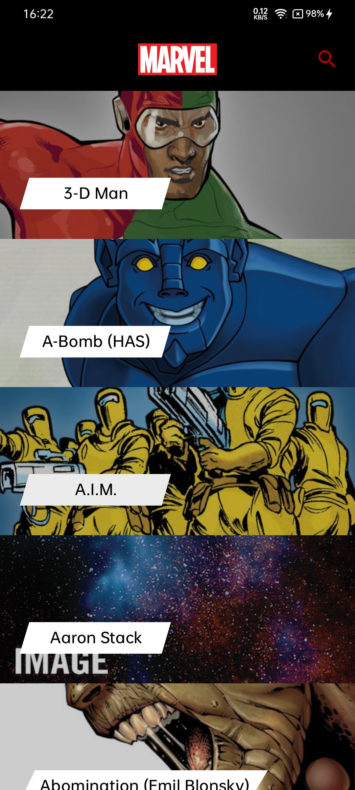
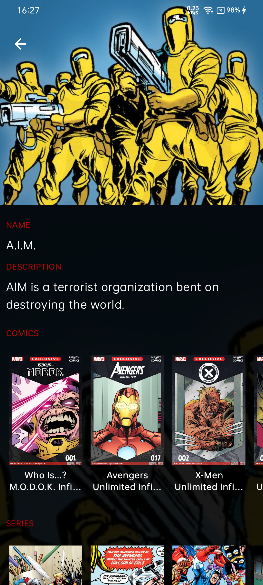
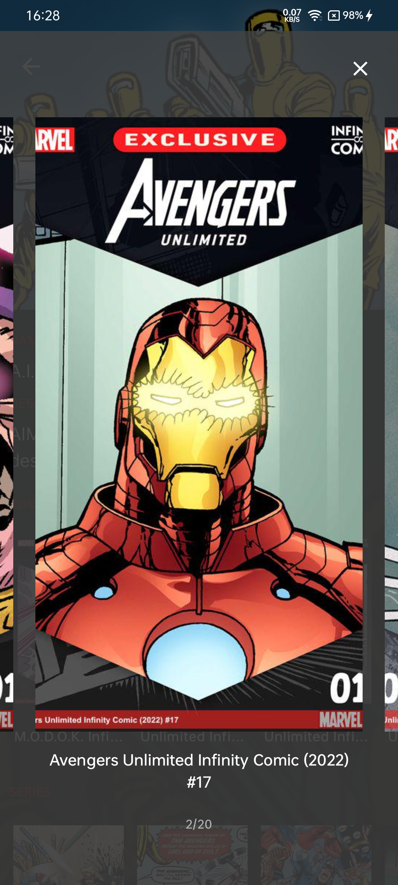
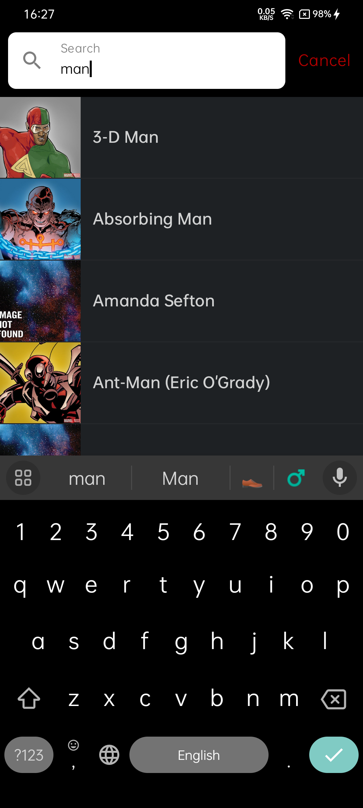
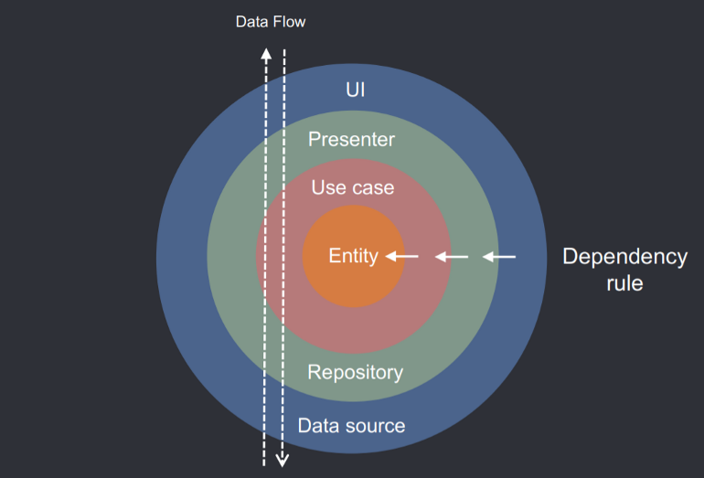

# Marvel App

A simple Marvel characters app built using Jetpack Compose, Paging 3, and Kotlin Coroutines, implementing a clean architecture approach with the
MVVM (Model-View-ViewModel) pattern. The app fetches data from the Marvel API to display a list of characters, supports pagination, and includes
detailed character views.

## Table of Contents

- [Screenshots](#screenshots)
- [Features](#features)
- [Architecture](#architecture)
- [Technologies Used](#technologies-used)
- [Setup and Installation](#setup-and-installation)

## Screenshots

|                                            Characters List                                             |                                             Character Details                                              | Images Gallery                                                                                       |
|:------------------------------------------------------------------------------------------------------:|:----------------------------------------------------------------------------------------------------------:|------------------------------------------------------------------------------------------------------|
| <p align="center">  </p> | <p align="center">  </p> | <p align="center">  </p> |
|                                                 Search                                                 |                                                                                                            |                                                                                                      |
|   <p align="center">  </p>   |                                                                                                            |                                                                                                      |

## Features

- **Character List**: Displays a list of Marvel characters loaded from the Marvel API with pagination support.
- **Search**: Filter results by character name using the search functionality.
- **Character Details**: View detailed information about a character, including images of comics, series, stories, and events (lazy-loaded as needed).
  Empty sections are hidden if no data is available.
- **Images Gallery**: Preview details screen section in gallery view.

## Architecture

This project follows Clean Architecture principles to ensure separation of concerns and scalability. It is implemented using the MVVM (
Model-View-ViewModel) pattern. Key layers include:

1. **Presentation Layer**: Jetpack Compose for UI and ViewModels for state management.
2. **Domain Layer**: Use cases encapsulating business logic.
3. **Data Layer**: Repositories interacting with the Marvel API using Retrofit.

<p align="center">
  
</p>

## Technologies Used

- **[MVVM Architecture](https://en.wikipedia.org/wiki/Model%E2%80%93view%E2%80%93viewmodel)**: Implements Model-View-ViewModel pattern for separation
  of concerns.
- **[Kotlin](https://kotlinlang.org/)**: Official programming language for Android development.
- **[Jetpack Compose](https://developer.android.com/jetpack/compose)**: Modern toolkit for building native UI.
- **[Paging 3](https://developer.android.com/topic/libraries/architecture/paging/v3-overview)**: For handling infinite scrolling and pagination.
- **[Retrofit](https://square.github.io/retrofit/)**: A type-safe HTTP client for API communication.
- **[Kotlin Coroutines](https://developer.android.com/kotlin/coroutines)**: Asynchronous programming with structured concurrency.
- **[Hilt](https://developer.android.com/training/dependency-injection/hilt-android)**: Dependency injection library for Android.
- **[Flow](https://developer.android.com/kotlin/flow)**: Reactive streams for managing asynchronous data streams.
- **[Material3 Design](https://m3.material.io/)**: UI/UX design framework.

## Setup and Installation

1. Clone the repository:

   ```bash
   git clone https://github.com/MuhamedFathy/MarvelApp.git
   ```

2. Open the project in Android Studio.

3. Obtain your Marvel API keys from [Marvel Developer Portal](https://developer.marvel.com/) and add them to the project:

    - Navigate to `local.properties` (project-level).
    - Add the keys as `PUBLIC_API_KEY` and `PRIVATE_API_KEY` in the file.

```
PUBLIC_API_KEY="key_here"
PRIVATE_API_KEY="key_here"
```

4. Sync, build, and run the project.
